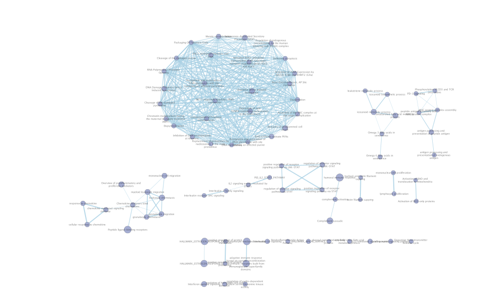
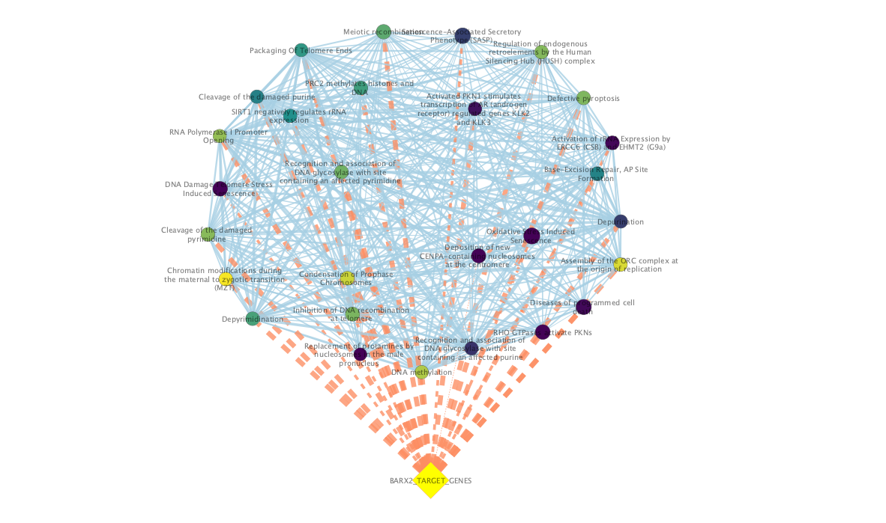

```{r setup, include=FALSE}
knitr::opts_chunk$set(fig.path = "figures/")

# install dependencies
if (!require("BiocManager", quietly = TRUE))
  install.packages("BiocManager")

if (!require("tools", quietly = TRUE))
  install.packages("tools")

if (!requireNamespace("edgeR", quietly = TRUE))
  BiocManager::install("edgeR")

if (!requireNamespace("data.table", quietly = TRUE))
  BiocManager::install("data.table")

if (!requireNamespace("kableExtra", quietly = TRUE))
  BiocManager::install("kableExtra")

if (!requireNamespace("limma", quietly = TRUE))
  BiocManager::install("limma")

if (!requireNamespace("pheatmap", quietly = TRUE))
  BiocManager::install("pheatmap")

if (!requireNamespace("ggplot2", quietly = TRUE))
  BiocManager::install("ggplot2")

if (!requireNamespace("dplyr", quietly = TRUE))
  BiocManager::install("dplyr")

library(dplyr)
library(ggplot2)

#install required R and bioconductor packages
tryCatch(expr = { library("RCurl")}, 
         error = function(e) {  
           install.packages("RCurl")}, 
         finally = library("RCurl"))
```

# Introduction

> Include a brief introduction section with a summary of the normalization and scoring done in the first two assignments. Assume that the person reading the report has not read your assignment #1 or #2 report. Including basic statistics from that analysis will be helpful. (for example, data downloaded from GEO with id X, …)

In our first assignment, we performed data preprocessing, filtering, and normalization on a GEO dataset. Specifically, the GEO dataset we analyzed was titled "Elevated GRHL2 imparts plasticity in estrogen receptor positive breast cancer cells [RNA-seq]" with the GEO accession GSE272061. This dataset was supplementary to the 2024 paper by Zheng et al. titled "Elevated GRHL2 Imparts Plasticity in ER-Positive Breast Cancer Cells" which can be obtained [here](https://www.mdpi.com/2072-6694/16/16/2906). The paper includes findings about how high expression of the transcription factor GRHL2 corresponds to worse cancer outcomes [@zheng2024]. This dataset consists of 3 conditions: GFPnegative, GFPpositive, and negative control which was sampled from 5 different patients.

At the beginning of analysis, we found that 57500 genes were in the dataset originally. To create a higher quality dataset, we filtered out genes with low counts to obtain a total of 21975 genes. Next, we mapped the genes to HUGO gene symbols. Some of these genes mapped to empty strings or na, so these were filtered out as well giving us a total of 18863 genes. The count data was then normalized using edgeR's[@edger] cpm function which we utilize for analysis in assignment 2. 

Then in assignment 2, we conducted thresholded over-representation analysis on the GFPPositive versus GFPNegative dataset. We separated upregulated and downregulated genes based on the sign of their logFC value. We utilized annotation data from GO Biological process (GO:BP)[@go_bp], WikiPathways (WP)[@wiki_pathways], Reactome (REAC)[@reactome], and Kyoto Encyclopedia of Genes and Genomes (KEGG)[@kegg]. In the end, we then ran gprofiler[@gprofiler] to obtain a ranked list of genesets for upregulated and downregulated genes. In the end, we used a p-value threshold of 0.05 to obtain significant genesets. As a result, we obtained 572 upregulated genesets and 406 downregulated genesets.

As a result, we created a ranked list of genes for genesets with upregulated genes and downregulated genes. We have uploaded them to github and load them in below.
```{r eval=TRUE, message=TRUE}
# Getting the ranked gene sets from Assignment 2
destfile = "precomputed/upreg_genes_gost.rds"
if (!file.exists(destfile)) {
  download.file(
    url = "https://github.com/bcb420-2025/Koji_Wong/raw/refs/heads/main/A3_KojiWong/precomputed/upreg_genes_gost.rds",
    destfile = destfile
  )
}
# Load in the normalized count matrix from our rds object file
upreg_genes_gost <- readRDS(destfile)

destfile = "precomputed/downreg_genes_gost.rds"
if (!file.exists(destfile)) {
  download.file(
    url = "https://github.com/bcb420-2025/Koji_Wong/raw/refs/heads/main/A3_KojiWong/precomputed/downreg_genes_gost.rds",
    destfile = destfile
  )
}
# Load in the normalized count matrix from our rds object file
downreg_genes_gost <- readRDS(destfile)

destfile = "precomputed/qlf_output_hits.rds"
if (!file.exists(destfile)) {
  download.file(
    url = "https://github.com/bcb420-2025/Koji_Wong/raw/refs/heads/main/A3_KojiWong/precomputed/qlf_output_hits.rds",
    destfile = destfile
  )
}

qlf_output_hits <- readRDS(destfile)
```


# Non-thresholded Gene set Enrichment Analysis

## Conduct non-thresholded gene set enrichment analysis using the ranked set of genes from Assignment #2.

> Q1. What method did you use? What genesets did you use? Make sure to specify versions and cite your methods.
Summarize your enrichment results.

As the latest version of GSEA was not compatible with Java 11 on the docker image, a previous version compatible was obtained v4.3.3 located in the GSEA directory. Genesets of size between 15 and 200 were taken so as to not get genesets that were too large and dominate over other genesets. Additionally 1000 permutations are used to obtain a significant amount of randomness for the analysis. We use no collapse since we've already mapped gene symbols to genes. We also set the scoring scheme to weighted rather than using a presence/absence of ranking order. The most recent gmt file version (March 1, 2025) from the Bader Lab was used which can be obtained [here](https://download.baderlab.org/EM_Genesets/March_01_2025/Human/symbol/#:~:text=Human_GOBP_AllPathways_noPFOCR_no_GO_iea_March_01_2025_symbol.gmt) [@enrichment_map]

### Rank calculation
To calculate the rank we utilize the formula `sign(logFC) * -log10(pvalue)` which returns a rank value. A positive sign for logFC indicates upregulation while negative sign indicates downregulation, which is reflected in the rank. If the dataset was ordered by descending rank, then the top results would be the most upregulated expressed genes while the bottom results would be the downregulated genes.
```{r}
analysis_table <- qlf_output_hits$table
# calculate rank by taking sign of logFC * log Pvalue
# positive sign for logFC indicates upregulation while negative indicates downregulation
analysis_table$rank <- -log(
  analysis_table$PValue, base = 10
) * sign(analysis_table$logFC)

# sort analysis table by pvalue and rank
sorted_pvalue_analysis_table <- analysis_table[order(analysis_table$PValue), ]
knitr::kable(head(sorted_pvalue_analysis_table), caption="Table 1. Ranked genes ordered by lowest p-value.")
sorted_rank_analysis_table <- analysis_table[order(analysis_table$rank), ]
knitr::kable(head(sorted_rank_analysis_table), caption="Table 2. Ranked genes ordered by lowest rank. Note that rank signs correspond to logFC signs.")
```


Here, we write our rank file out so that we can use it in downstream non-thresholded gene set enrichment analysis (GSEA)[@gsea]. 
```{r}
# write the table to a tsv file
ranked_path <- "./data/GFPPositive_GFPNegative.rnk"
analysis_table$hgnc_symbol <- rownames(analysis_table)
ranks <- as.matrix(analysis_table[,c("hgnc_symbol", "rank")])

write.table(
  ranks,
  file = ranked_path,
  col.names = FALSE,
  row.names = FALSE,
  sep = "\t",
)

knitr::kable(head(analysis_table[,c("hgnc_symbol", "rank")]))
```

### Running GSEA 
GSEA is used to determine if a set of ranked genes are significantly expressed and categorizes them into overlapping gene sets. For the sake of computation time, the GSEA was run previously and the run ID saved for reference. If the reader wishes to run GSEA from code, please set `run_gsea <- TRUE` and update the `gsea_run_id` to that run id. The data files from the run are located in `data/GFPNegative_vs_GFPPositive.GseaPreranked.1743482506447`. 
```{r}
# GSEA parameters
working_dir <- file.path(getwd(), "data")
output_dir <- file.path(getwd(), "generated")
analysis_name <- "GFPPositive_vs_GFPNegative"
rnk_file = "GFPPositive_GFPNegative.rnk"
rank_list <- as.matrix(analysis_table[,c("hgnc_symbol", "rank")])
run_gsea <- FALSE
gsea_run_id <- "1743482506447"
dest_gmt_file = ""

analysis_name <- "GFPNegative_vs_GFPPositive"
output_dir <- "./data"

gsea_jar <- file.path(getwd(), "GSEA/gsea-cli.sh")
dest_gmt_file = ""

## download the .gmt file
if(dest_gmt_file == ""){
  gmt_url = "http://download.baderlab.org/EM_Genesets/current_release/Human/symbol/"
  
  #list all the files on the server
  filenames = getURL(gmt_url)
  tc = textConnection(filenames)
  contents = readLines(tc)
  close(tc)
  
  #get the gmt that has all the pathways and does not include terms 
  # inferred from electronic annotations(IEA)
  #start with gmt file that has pathways only and GO Biological Process only.
  rx = gregexpr("(?<=<a href=\")(.*.GOBP_AllPathways_noPFOCR_no_GO_iea.*.)(.gmt)(?=\">)",
                contents, perl = TRUE)
  gmt_file = unlist(regmatches(contents, rx))
  
  dest_gmt_file <- file.path(output_dir,gmt_file )
  
  #check if this gmt file already exists
  if(!file.exists(dest_gmt_file)){
    download.file(
      paste(gmt_url,gmt_file,sep=""),
      destfile=dest_gmt_file
    )
  }
}

# set to false, can set to true to run the command
if(run_gsea){
  command <- paste("",gsea_jar,  
                   "GSEAPreRanked -gmx", dest_gmt_file, 
                   "-rnk" ,file.path(working_dir,rnk_file), 
                   "-collapse false -nperm 1000 -scoring_scheme weighted", 
                   "-rpt_label ",analysis_name,
                   "  -plot_top_x 20 -rnd_seed 12345  -set_max 200",  
                   " -set_min 15 -zip_report false ",
                   " -out" ,output_dir, 
                   " > gsea_output.txt",sep=" ")
  system(command)
}
```

Now that GSEA has been performed, we can check the results. We load in the resulting na_pos and na_neg tables as tsvs into dataframes. 
```{r}
result_dir <- paste("data/", analysis_name, ".GseaPreranked.", gsea_run_id, sep="")
na_pos_file <- file.path(getwd(), 
                         result_dir, 
                         paste("gsea_report_for_na_pos_", 
                               gsea_run_id, 
                               ".tsv",
                               sep = ""))
na_neg_file <- file.path(getwd(), 
                         result_dir, 
                         paste("gsea_report_for_na_neg_", 
                               gsea_run_id, 
                               ".tsv",
                               sep = ""))
positive_ranked <- as.data.frame(data.table::fread(na_pos_file))
negative_ranked <- as.data.frame(data.table::fread(na_neg_file))
# knitr::kable(head(positive_ranked))
# knitr::kable(head(negative_ranked))
```

### Filtering upregulated and downregulated genesets by FDR
Next, we choose the gene sets that satisfy an FDR threshold of 0.05 which indicates it is significant. 
```{r}
filtered_pos <- positive_ranked[positive_ranked["FDR q-val"] < 0.05,]
filtered_neg <- negative_ranked[negative_ranked["FDR q-val"] < 0.05,]
```


> Q2. How do these results compare to the results from the thresholded analysis in Assignment #2. Compare qualitatively. Is this a straight forward comparison? Why or why not?

```{r}
cols <- c("NAME", "ES", "NES", "FDR q-val", "LEADING EDGE")
# print out some pretty tables
knitr::kable(head(filtered_pos[,cols], 5), format = "html") %>%
  kableExtra::kable_styling(bootstrap_options = "striped", full_width = F) %>%
  kableExtra::scroll_box(height = "500px")
knitr::kable(head(filtered_neg[,cols]), format = "html") %>%
  kableExtra::kable_styling(bootstrap_options = "striped", full_width = F) %>%
  kableExtra::scroll_box(height = "100px")
```
Surprisingly, no genesets were found to be significantly enriched for the negative phenotype with FDR < 0.05. Even changing this to 0.25 to be more lax, it was found that there was 0. As we saw in Assignment 2 as well, it seemed upregulated genes dominated and had more annotations with GOBP, WikiPathways and even KEGG while for downregulated genes we only saw GOBP. Despite getting 406 downregulated genesets with FDR < 0.05, they may have not had enough logFC change in the negative direction meaning they were similarly expressed across the two conditions, which would reflect on the rank values used for GSEA. 

To explain in terms of biological significance, this tells us that in the GRHL2 cancer phenotype, we see mostly upregulated pathways dominating the genesets. We could chalk this up to how genes relating to cancer tend to be overly activated such as in cell proliferation and immune signalling rather than repressed. This would make sense for our data since we are comparing 2 breast cancer phenotypes, just one with GRHL2 positive and the other being negative to see how GRHL2 influences breast cancer.

# Using your results from your non-thresholded gene set enrichment analysis visualize your results in Cytoscape.

> 1. Create an enrichment map - how many nodes and how many edges in the resulting map? What thresholds were used to create this map? Make sure to record all thresholds. Include a screenshot of your network prior to manual layout.



In total, there are 85 nodes (genesets) and 421 edges (overlaps). We used a FDR q-value cutoff of 0.1 to allow a bit more leniency to allow more genesets to be included in the analysis. We used the default layout Prefuse Force Directed Layout and Automatic Data set Edges.

> 2. Annotate your network - what parameters did you use to annotate the network. If you are using the default parameters make sure to list them as well.

The following figure was annotated using AutoAnnotate tool by the Bader Lab [@autoannotate]. The default parameters were used to annotate which were 3 max words per label, 1 minimum word occurence, 8 adjacent word bonus, medium amount of clusters, no singleton clusters and no alyout network to minimize cluster overlap. 


> 3a. Make a publication ready figure - include this figure with proper legends in your notebook.


> 3b. Collapse your network to a theme network. What are the major themes present in this analysis? Do they fit with the model? Are there any novel pathways or themes?

![Figure 4. Theme Network. The genesets were clustered using AutoAnnotate's Create Summary Network function, to include unclustered nodes. Additionally the node sizes correspond to gene set size. In total, there are 26 nodes and 2 edges. There is an edge between "leukocyte chemotaxis migration" (GO:0030595) and "chemokine mediated pathway" (GO:1990868) as well as an edge between "il2 signalling events mediated by stat5" (PID_IL2_STAT5_PATHWAY) and "interleukin receptor shc signaling" (Reactome 451927) This indicates a theme of immune response further discussed in the later parts of the report. ](figures/theme_network.png)


# Interpretation and detailed view of results
> 1/2. Do the enrichment results support conclusions or mechanism discussed in the original paper? How do these results differ from the results you got from Assignment #2 thresholded methods? Can you find evidence, i.e. publications, to support some of the results that you see. How does this evidence support your result?

From Figure 3 we can already tell that there seems to be a pattern of immune system response given the annotated clusters of chemokine-mediated pathways, leukocyte migration, lymphocyte proliferation, interleukin signaling (IL-2, STAT5, IL-SHC2) all having to do with immune cell recruitment, activation, and differentiation. This makes sense given that we are looking at a breast cancer dataset, where white blood cells (leukocytes) are being activated and genes are being expressed to help migrate these leukocytes, as well as chemokine mediated pathway where chemokines are signalling proteins which help guide immune cells.


Figure 4 consolidates and adds confidence to these results by adding an edge between these 2 clusters, indicating that there is a strong theme of immune response. Additonally, we see a cluster between "il2 signalling events by stat5" and "interleukin shc 2 signalling" further indicating that the high expression of interleukin there is signalling occuring with interleukin, another group of proteins produced by leukocytes. A high immune response would make sense in this context where leukocytes are known to infiltrate breast cancer tumours and are upregulated during these times [@telma2012].


Furthermore, the largest cluster named inhibition dna methylation is actually short for "site inhibition dna methylation telomere". Within this cluster are many genesets corresponding to telomere overexpression. In healthy patients, telomeres are supposed to get shorter to prevent cells from getting too old. However, in cancers, we know that telomerase enzyme overexpression can extend cell life and keep cells alive despite repeated cell division, leading to tumour growth [@methylation]. I believe that this is showing exactly that, where we are seeing upregulation of telomeres and inhibiting DNA methylation, which is known to silence genes to control gene expression. From the paper [@methylation] we also see that DNA methylation corresponds to anti-tumour drugs, so conversely preventing DNA methylation mechanisms could allow tumours to grow.

These findings correspond to our Assignment 2 results which showed a high upregulation of genesets involved with signalling, response to stimulus, cytokine signaling in immune system and signal transduction. These results through enrichment map analysis seem to give us a much more in-depth picture of the genesets and how they relate to each other with overlapping genes.

# Post analysis
> Add a post analysis to your main network using specific transcription factors, microRNAs or drugs. Include the reason why you chose the specific miRs, TFs or drugs (i.e publications indicating that they might be related to your model). What does this post analysis show?

The figure below was generated using Enrichment Map and adding signature gene sets from the web. Transcription factors from the same March_01_2025 human geneset were used to create this network. We chose the highest Mann-Whitney score which turned out to be BARX2, a gene that encodes a transcription factor relevant to cancer.




It was found BARX2 interacts with the entire cluster involving site inhibition of DNA methylation on telomeres. Through investigating which TF has high interactions with these upregulated genesets, we may be able to infer possible drug targets involved or correlated with these genes involved in cell proliferation and tumour progression. Specifically, it was found that downregulation of BARX2 corresponds to breast cancer, indicating that the factor plays a vital role in maintaining cell growth and that dysregulation of it can lead to tumour growth. 

Conduction further research, it was found that BARX2 plays a significant role in breast cancer progression through its interaction with estrogen receptor-alpha (ESR1) [@stevens2006]. Specifically, BARX2 binds to different ESR1 gene promoters, enhancing the expression of alternatively spliced ESR1 isoforms, particularly the 46 kDa variant. This modulation influences estrogen-dependent processes, including cell growth and invasion. So, from Figure 5 and our further research, it draws that the presence of BARX2 may play a part in the modulation of these upregulated gene sets that otherwise would not occur if it was being downregulated.

# Works Cited
